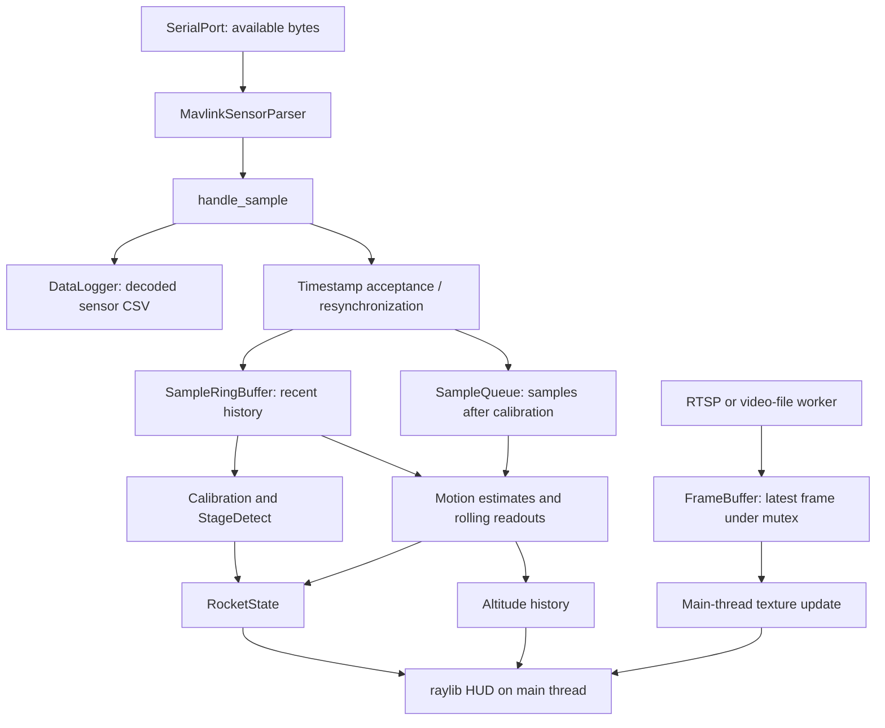

# BYU Telemetry HUD

A C++20 desktop telemetry display for BYU Rocketry. The live application reads
sensor samples from a serial port using a custom MAVLink 2 message, calibrates
sensor biases and ground altitude, estimates motion and flight stage, and renders
a fullscreen raylib HUD. An OpenCV worker receives RTSP video independently of
the telemetry input.

The repository also contains a static HUD preview, a serial diagnostic, CSV
playback utilities, recorded telemetry, and FAR flight-analysis data. **The CSV
playback targets currently do not drive the HUD's state updates:** they emit CSV
text, while the active ingestion path accepts MAVLink bytes only.

This README describes the implementation in this checkout. Questions marked
`[NEEDS MY INPUT: ...]` identify context or design rationale that the code does
not establish.

## Build and executables

### Requirements

- CMake 3.20 or newer for the main project.
- A C++20 compiler and standard library supporting the code's `std::format` and
  chrono formatting.
- raylib with a CMake config package.
- OpenCV with a CMake package; camera capture explicitly selects its FFmpeg
  backend.
- For `replay`, an external `nlohmann/json.hpp` on the compiler's include path.
  A single-header copy exists at `include/util/json.hpp`, but the replay source
  does not include that file, and CMake does not discover or link a JSON package.
- For the separate unit-test project, GoogleTest and Threads, subject to the
  build gaps described under [Testing and verification](#testing-and-verification).

The serial implementation uses POSIX `open`, `read`, and `termios`, and the
configured device path is macOS-specific. There is no Windows serial backend.
The build does not download dependencies, pin their versions, or install/package
the application and its resources.

[NEEDS MY INPUT: Which operating systems and compiler/dependency versions should
be supported, and is distribution intended to be a source checkout or a packaged
application?]

### Build commands

From the repository root, with raylib and OpenCV installed where CMake can find
them:

```sh
cmake -S . -B build
cmake --build build --target BYU_Telemetry_HUD static_test sensor_out raven_test --parallel
```

Use `CMAKE_PREFIX_PATH`, `raylib_DIR`, or `OpenCV_DIR` when those packages are
outside CMake's search paths.

The root [CMakeLists.txt](CMakeLists.txt) defines five executables:

| Target | Entry point | Current behavior |
| --- | --- | --- |
| `BYU_Telemetry_HUD` | [src/main.cpp](src/main.cpp) | Live serial/MAVLink HUD, three-second calibration window, RTSP feed, sensor CSV logging enabled. |
| `static_test` | [tests/static_gui_test.cpp](tests/static_gui_test.cpp) | Draws the HUD with default state at Pad; no telemetry source, calibration gate, or camera worker. |
| `sensor_out` | [tests/sensor_read.cpp](tests/sensor_read.cpp) | Reads the configured serial port, parses MAVLink, and prints each decoded sample's `t_us` to the terminal. |
| `raven_test` | [tests/raven_test/main.cpp](tests/raven_test/main.cpp) | Supplies timed CSV text with a one-second calibration window and diagnostic logging enabled. Its input path is hard-coded to the developer's checkout; the CSV/MAVLink mismatch prevents calibration from filling. |
| `replay` | [src/read_recorded.cpp](src/read_recorded.cpp) | Configures CSV and video-file playback using `sync.json`, with a three-second calibration window. It has the same CSV/MAVLink mismatch. |

To build all five, `nlohmann/json.hpp` must also be discoverable. For example,
with the JSON headers installed at the following Apple Silicon Homebrew prefix:

```sh
cmake -S . -B build -DCMAKE_CXX_FLAGS="-I/opt/homebrew/opt/nlohmann-json/include"
cmake --build build --parallel
```

That include-path setting is a workaround for the current CMake setup. Adjust
the path for your installation and preserve any other compiler flags you use.

### Run the live HUD

Run executables **from the repository root**. Model, font, and shader paths are
relative to the process's working directory; CMake does not copy these assets
into the build directory.

1. Check `PORT_NAME`, `BAUD_RATE`, and `RTSP_URL` in
   [include/telemetry/telemetry_config.hpp](include/telemetry/telemetry_config.hpp).
   Their current values are `/dev/cu.usbmodemN32G45x1`, `115200`, and
   `rtsp://192.168.144.25:8554/main.264`. Serial setup passes `BAUD_RATE` directly
   to the platform's `termios` speed functions.
2. Connect the serial device before launch. If the initial port open fails,
   `SerialPort` stays in a “Waiting for connection” loop **without retrying
   `open()`**. Connect/configure the device and restart the process in that case.
3. Ensure the sensor-log output directory exists, then launch:

   ```sh
   mkdir -p data/logged_data
   ./build/BYU_Telemetry_HUD
   ```

4. Click **CALIBRATE** with the sensor package stationary in its expected
   mounting orientation. The click discards currently available input. New
   samples then fill the calibration window; the percentage is based on sample
   timestamps. The main HUD appears when calibration transitions to Pad.
5. Press **Esc** to exit.

For a visual preview without a serial device:

```sh
./build/static_test
```

Port, source, and display settings are compiled into the executables. The entry
points do not parse command-line options.

## Architecture and runtime flow



[RunHud](src/hud/run_hud.cpp) owns the application loop and the optional camera
worker. [HudApp](include/hud/hud_app.hpp) holds rendering resources, layout,
`RocketState`, sample queues, graph history, optional data logger, and the latest
camera frame/texture. `RocketState` contains the current stage, calibration
biases, altitude and motion estimates, latest sample, and rolling sample history.
The state layer depends on `HudApp` and raylib types; it is not an independent
headless library.

Each frame with an initialized telemetry source does the following:

1. Start the camera worker if a `CameraFeedConfig` is present and no worker has
   been created, then copy/upload a new camera frame if available.
2. Call `UpdateState`, which reads all currently available source bytes and
   passes them through a persistent MAVLink parser.
3. Log decoded samples, apply timestamp acceptance rules, and append accepted
   samples to rolling history. Samples received after calibration also enter the
   FIFO queue for state integration.
4. Run `StageDetect::update` once against that history. If still calibrating,
   return without integrating motion.
5. Drain the FIFO in timestamp order, update motion/altitude, append flight
   graph points, and set the rocket model's transform from the orientation.
6. Update lighting once calibration has finished, and draw the appropriate HUD
   or calibration screen.

Stage detection runs **before** the current frame's FIFO is drained, rather than
once per sample. The camera worker starts after the calibration button is clicked,
while sample-window calibration may still be in progress. Telemetry reads,
parsing, estimation, sensor logging, texture uploads, and drawing all run on the
main thread; capture/decoding runs on the camera thread. On exit, the application
unloads graphics resources and the camera owner stops and joins its worker.

The `no_calibrate` argument assigns Pad on every frame, rather than performing a
one-time skip. Its current caller is `static_test`, which has no telemetry source.

[NEEDS MY INPUT: What constraints led to the shared HudApp/state structure and
main-thread telemetry processing, with only camera capture on a worker thread?
What telemetry rate and responsiveness requirements should this architecture meet?]

## Telemetry input and buffering

### Source interface and binary protocol

[TelemetrySource](include/telemetry/telem_source.hpp) exposes
`read_available() -> std::string`; the string can contain binary bytes.
`discard_available()` calls that method and drops its result. `SerialPort` uses a
nonblocking file descriptor and drains input in 256-byte reads. `CsvTelemSource`
implements the same interface but returns text. The interface does not identify
the encoding, and the active `ReadSamples` path always selects the binary parser.

The handwritten [MavlinkSensorParser](src/telemetry/mavlink_sensor_parser.cpp)
buffers partial frames across calls and scans for the `0xFD` start byte. Its
accepted message contract is:

| Property | Value in this implementation |
| --- | --- |
| Framing | MAVLink 2, ten-byte header including the start byte, two-byte CRC |
| Message ID | `300` |
| CRC extra | `95` |
| Full payload | 72 bytes: one little-endian `uint64_t`, then 16 little-endian 32-bit floats |
| Short payloads | Zero-padded to 72 bytes before decoding |
| Oversized payloads | Rejected |
| Signed-frame flag | Accounts for a 13-byte signature trailer; does not authenticate it |

The payload order matches `SensorData` and the CSV column order below. CRC failures
and other message IDs do not produce samples. Parser statistics count successful
frames, CRC failures, oversized payloads, and ignored IDs, but are not connected
to the HUD. Sequence numbers and sender IDs are not used for packet-drop tracking
or source selection. This is a parser for this particular message, not a general
MAVLink message dispatcher.

| Field(s), in payload order | Interpretation in the application |
| --- | --- |
| `t_us` | Source timestamp in microseconds; used for integration, history windows, and stage timers. |
| `ax, ay, az` | Normal-range acceleration, treated as m/s². |
| `gx, gy, gz` | Angular rate, treated as rad/s. |
| `mx, my, mz` | Magnetometer readings; decoded and logged, unused by the estimator. |
| `imuTempC` | IMU temperature, named in °C; decoded and logged. |
| `baroTempC, pressPa` | Barometer temperature and pressure, named in °C and Pa; decoded and logged. |
| `altM` | Received altitude in metres, used directly as ASL altitude. |
| `hgx, hgy, hgz` | High-range acceleration, treated as m/s². |

Units are not converted or validated by the binary parser. The HUD does not
derive altitude from `pressPa`.

[NEEDS MY INPUT: Where is the transmitting firmware or authoritative MAVLink
message definition for ID 300 / CRC extra 95, and why was this custom message
chosen? Please confirm sensor models, transmitted units including magnetometer
units, timestamp origin/reset behavior, and the altitude reference.]

### Sample history and timestamp recovery

[SampleRingBuffer](include/telemetry/sample_ring_buffer.hpp) holds at most 200
samples and evicts samples older than its requested duration. Durations above
three seconds are clamped to three seconds. The live app requests `3,000,000 µs`;
the `buffer_size` argument is a **duration**, not a sample count. Calibration
considers the duration full when the oldest-to-newest timestamp span plus a
40,000 µs tolerance reaches that duration. At sufficiently high sample rates,
the 200-sample capacity can prevent a full three-second span from being retained.

[SampleQueue](include/telemetry/sample_buffer.hpp) is a separate FIFO of samples
awaiting integration. In [handle_sample](src/state/state_update.cpp):

- An increasing timestamp is accepted into history and, outside calibration,
  into the FIFO.
- An equal timestamp is discarded from state processing.
- A decreasing timestamp starts resynchronization. The application collects five
  strictly increasing timestamps; another decrease restarts that collection and
  duplicates are ignored.
- Once five samples are collected, history and the FIFO are cleared and seeded
  from them, and `last_measured_time` resets to zero.

Sensor logging occurs before these checks, so logs can include duplicates and
samples withheld during resynchronization. Resynchronization preserves biases,
orientation, velocity, flight stage, stage/launch timestamps, and graph history.
Consequently, it does not reset a flight session; old stage/launch timestamps can
be incompatible with a restarted source clock. Forward timestamp gaps have no
active upper bound before integration.

[NEEDS MY INPUT: What source rate and timing faults motivated the 200-sample cap,
three-second window, 40 ms tolerance, and five-sample resynchronization rule?
After a source clock reset, which calibration and flight state should survive?]

## Calibration and motion estimates

### Frames and startup calibration

[calibration.hpp](include/state/calibration.hpp) defines the fixed sensor-to-body
mapping as `(x, y, z) -> (z, -y, x)`.
[process_sample](include/state/sample_processing.hpp) applies it to both
accelerometers and the gyroscope. Quaternion increments also pass through the
body-to-render conversion in [forconverter.hpp](include/state/forconverter.hpp).

Once the calibration window fills, [handle_calib](src/state/detection/stage_detect.cpp):

- Averages each accelerometer and the gyroscope over the retained history, then
  maps those means into body coordinates.
- Subtracts `9.81` from the body-Z mean of each accelerometer to obtain its bias.
- Stores the gyro mean as its bias and mean `altM` as ground altitude.
- Advances from Calibrating to Pad.

This calculation assumes a stationary package whose expected acceleration maps
to positive body Z. Orientation starts at the identity quaternion; calibration
does not estimate an initial tilt or compass heading. There is no motion/stability
check before accepting calibration, and no recalibration control in the live HUD.

[NEEDS MY INPUT: What physical mounting and body/world/render axis conventions
justify these transforms and the positive-Z gravity assumption? Why is identity
orientation the correct initial model pose for the intended setup?]

### Per-sample calculations

The first queued sample establishes the timestamp and altitude baseline.
Subsequent increasing timestamps produce `dt = Δt_us / 1,000,000` and the
following updates in [state_update.cpp](src/state/state_update.cpp):

| State/readout | Calculation |
| --- | --- |
| Orientation | Map gyro to body coordinates, subtract gyro bias, form an axis-angle quaternion from angular rate × `dt`, convert the increment to render coordinates, multiply it into the current orientation, and normalize. |
| Integrated velocity | Use normal acceleration when the high-range vector magnitude is below `100 m/s²`; otherwise use high-range acceleration. Subtract that sensor's bias, transform with the current orientation, compute `{0, 0, 9.81} - accel_world`, and integrate each component over `dt`. Total velocity is the resulting vector magnitude. |
| G force | Use the same magnitude threshold to select an accelerometer, then divide its uncorrected magnitude by `9.80665`. Gravity is included in this readout. |
| ASL / AGL altitude | Store received `altM` as ASL; subtract calibrated ground altitude for AGL. |
| Instantaneous vertical velocity | Divide consecutive received-altitude differences by `dt`. |
| Displayed vertical velocity | Use the ring buffer's two-second altitude slope, rather than the instantaneous value or integrated velocity. |
| Roll / pitch / yaw rates | Map the one-second mean gyro vector to body coordinates and display Z / X / Y respectively, in rad/s. These displayed rates do not subtract gyro bias. |
| Samples per second | Store `1 / dt` from the latest processed interval; this is not a wall-clock packet count. |

Orientation uses gyro integration without accelerometer or magnetometer attitude
correction. Integrated velocity has no external correction or Pad zeroing.
Position, Euler attitude angles, and the acceleration fields declared in
`RocketState` are not populated by the active update path. Integrated velocity is
computed but is not shown in the current sensor panel.

[NEEDS MY INPUT: Why were gyro-only orientation and acceleration integration
chosen, what accuracy/drift is acceptable, and how were the acceleration sign,
coordinate transforms, gravity constants, and 100 m/s² sensor switch validated?]

## Automatic flight-stage detection

[StageDetect](src/state/detection/stage_detect.cpp) implements the following
transitions. Timers use telemetry timestamps. Acceleration and gyro thresholds
operate on the magnitude of the averaged raw vector; they do not use calibrated
motion estimates.

| Transition | Current condition |
| --- | --- |
| Calibrating → Pad | Calibration history reaches its requested duration, then biases and ground altitude are stored. |
| Pad → Boost | Magnitude of the preceding 0.5-second mean normal acceleration is greater than `50 m/s²`. |
| Boost → Coast | Magnitude of the preceding 0.3-second mean normal acceleration is below `15 m/s²`, after more than one second in Boost. |
| Coast → Apogee | More than ten seconds in Coast and the 0.5-second altitude slope is below `10 m/s`. |
| Apogee → Descent | More than five seconds in Apogee. |
| Descent → Recovery | More than 240 seconds in Descent, two-second altitude slope below `1 m/s`, and magnitude of the 0.5-second mean gyro below `2 rad/s`. |

`RocketState::transition_to` rejects backward transitions and jumps over a stage;
Recovery has no further handler. The apogee condition is a threshold-and-time
rule, not detection of an altitude maximum. The recovery vertical-velocity check
is signed (`v < 1`), not `abs(v) < 1`, so negative descent rates satisfy that part
of the condition.

On Boost detection, `launched_t_us` is assigned the last previously integrated
timestamp. Graph history then records AGL altitude against time since that
timestamp for samples processed beyond Pad.

[NEEDS MY INPUT: Which flight data or requirements justify each stage threshold,
averaging interval, and minimum duration? Is Recovery intended to use signed or
absolute vertical speed, and what event should define launch time?]

## HUD and camera feed

### Display

[SetupHudApp](src/hud/hud_app.cpp) creates a fullscreen window at the monitor
size, requests 4× MSAA, and targets 60 FPS. Layout is computed once at startup.
The left half contains the 3D scene above the video panel; the right half contains
stage indicators, sensor readouts, and an altitude-versus-time graph.

- The rocket uses `resources/models/new_model.glb`, a perspective camera, the
  bundled GLSL 330 lighting shaders, and a render texture at twice the scene's
  width and height. `resources/models/rocket.glb` is also tracked but is not the
  configured model.
- The altitude ladder shows AGL altitude against a 30,000 ft scale, with markers
  configured at 10,000 ft, 20,000 ft, and a marker named “BYU Rocketry Record” at
  7,095 m.
- The sensor panel contains a 0–25 G gauge, a vertical-velocity gauge clamped to
  −900–900 m/s, roll/pitch/yaw rate text in rad/s, and AGL/ASL altitude in feet.
- The graph plots recorded AGL points using 10-second and 500-metre tick
  intervals, configured for 360 seconds and 10,000 metres. Its history grows for
  the session; it does not auto-scale or cap the stored point count.
- Sample-rate and packet-drop draw calls are commented out. Packet-drop counters
  are not updated, so there is no active link-health panel.

[NEEDS MY INPUT: What operator requirements or mission profile determine the
panel arrangement, mixed display units, gauge limits, and graph/ladder scales?
Is the configured 7,095 m record marker still the value to present?]

### Camera threading and playback

[CameraFeed](include/telemetry/feed/rtsp_receiver.hpp) owns one worker thread and
an atomic stop flag. Its configuration holds the source URL/path as a non-owning
`std::string_view`, so the caller's string storage must outlive the worker.
`FrameBuffer` stores only the latest frame, copies it under a mutex on both
publication and consumption, and reports whether a new frame is available.
Frames can be replaced before the HUD consumes them. On the main thread,
`UpdateTextureFromMat` converts the normal BGR camera output to RGB and creates
or updates a raylib texture.

The [RTSP worker](src/telemetry/feed/rtsp_receiver.cpp) requests TCP transport,
a three-second open timeout, and a one-second read timeout. It retries unopened
streams after 500 ms. After ten failed reads or more than two seconds without a
good frame, it releases and reopens the decoder after a 300 ms delay.

The file worker seeks to the requested starting second, reads sequentially, and
sleeps for `floor(1000 / fps)` milliseconds after each frame, using 30 FPS when
FPS metadata is unavailable. It stops at a failed read or end of file. Seek
success is not checked, and frame decoding time is added to the per-frame sleep.

With no feed configured, the panel displays “CAMERA FEED.” Before the first
frame, an enabled feed displays “WAITING ON FEED.” After frames have arrived,
the last image remains visible if capture stalls or ends; there is no stale-frame
indicator. Camera creation depends on a non-null telemetry source and the optional
configuration. The `get_feed` argument to `RunHud` is currently unused.

[NEEDS MY INPUT: What latency, frame-dropping, and outage-display requirements
led to the single-latest-frame buffer and RTSP retry settings? What synchronization
accuracy is required between video and telemetry?]

## CSV data and recorded replay

The [CSV parser](src/telemetry/telemetry_parse.cpp), `CsvTelemSource`, test-source
helper, and sensor logger use this 17-column order:

```csv
t_us,ax,ay,az,gx,gy,gz,mx,my,mz,imuTempC,baroTempC,pressPa,altM,hgx,hgy,hgz
```

`parseLine` requires 17 fields and converts the timestamp and floats. `get_data`
skips a header and loads a whole CSV into a `SampleQueue`.
[CsvTelemSource](src/telemetry/CsvTelemSource.cpp) skips the header, optionally
skips samples before a requested timestamp, and emits due lines according to a
`steady_clock` playback timer started on its first read. With a zero start point,
it uses the first data row's timestamp as its origin. The calibration button's
discard call also starts this timer and discards any immediately due lines.

The [replay entry point](src/read_recorded.cpp) reads
[include/telemetry/feed/sync.json](include/telemetry/feed/sync.json) through a
build-time absolute `ROOT_DIR` path:

| JSON field | Meaning |
| --- | --- |
| `video_path` | Local video file to open. |
| `telem_data_path` | CSV telemetry file to open. |
| `video_sync_time_sec` | Position of the chosen synchronization event in the video. |
| `telem_sync_time_sec` | Timestamp of that event in the telemetry, expressed in seconds. |
| `replay_start_before_sync` | Seconds to subtract from both event times to select playback starts. |

Both paths are empty in the tracked configuration. Each start is calculated as
its sync time minus the pre-roll; telemetry start is then converted to unsigned
microseconds. Inputs are not checked for negative starts or valid ranges. Video
and CSV use independent pacing after startup, with no shared replay clock or
ongoing drift correction.

**Replay remains incomplete:** even with valid paths and a successful build,
`ReadSamples` sends CSV text to `MavlinkSensorParser`, producing no sensor samples
and leaving the HUD in calibration. `raven_test` has the same limitation. The
tracked `.bin` MAVLink captures are not connected to a file-source executable.

[NEEDS MY INPUT: Should recorded telemetry use CSV, raw MAVLink captures, or both,
and why? Which event should operators use for video/telemetry alignment, and
should replay reproduce calibration or start from previously calibrated state?]

The bundled data includes:

- `data/log_0001.csv`, `log_0007.csv`, and `log_0037.csv`: sensor CSV samples.
- `data/mavlink_capture.bin` and `mavlink_capture_motion.bin`: binary captures.
- `data/FAR Test Flight/`: primary/secondary Raven exports, GPS CSV/KML files,
  flight/simulation CSVs, an OpenRocket file, and an analysis workbook.
- `data/test_data/`: derived CSV fixtures and Python conversion scripts.
  `converter.py` matches primary Raven high/low-rate rows by time, converts units,
  fills unavailable channels with zero, and copies normal acceleration into the
  high-range fields. `reformat_time.py` shifts the first timestamp to zero.
  Running these scripts overwrites `test_data.csv` and `new_test_data.csv`
  respectively; they do not run as part of the CMake build.

## Logging and configuration

There are two separate logging mechanisms:

| Logger | Activation and output |
| --- | --- |
| [DataLogger](include/logging/data_logger.hpp) | `DATA_LOGGING=1` for the live target only. Creates `data/logged_data/data_log.csv`, then `data_log0.csv`, `data_log1.csv`, etc. to avoid existing names. Records decoded sensor fields before timestamp filtering, including calibration samples. It does not create the directory or report file-open failures. |
| [Logger](src/logging/logger.cpp) | `LOG_*` macros compile in only with `ENABLE_LOGGING=1`, currently set for `raven_test`, which selects TRACE severity. Creates `logs/` as needed and writes timestamped diagnostic files. Other targets compile these macros out. |

Both output paths are anchored to the source directory embedded as `ROOT_DIR` at
build time. Sensor logs contain neither derived rocket state nor video. New
sensor logs, diagnostic logs, and `data/video_files/` content are ignored by Git;
two sensor-log CSVs are already tracked.

[NEEDS MY INPUT: Why are decoded sensor CSVs the chosen recording format, and
should recordings also preserve raw frames, derived state, video timing, or parser
errors? What behavior is required when the output file cannot be written?]

Primary configuration locations:

| File | Settings |
| --- | --- |
| [include/telemetry/telemetry_config.hpp](include/telemetry/telemetry_config.hpp) | Serial device/speed, RTSP URL, time-window constants, graph's expected flight duration. `SAMPLE_RATE` and `EXPECTED_MAX_ALT_M` are declared but unused by the active path. |
| [src/main.cpp](src/main.cpp) | Live source, three-second sample-history duration, and feed configuration passed to `RunHud`. |
| [include/hud/config.hpp](include/hud/config.hpp) | Model path, target FPS, render scale, display dimensions/scales, text sizes, unit conversions, selected palette. |
| [include/hud/hud_layout.hpp](include/hud/hud_layout.hpp), [colors.hpp](include/hud/colors.hpp), [milestones.hpp](include/hud/milestones.hpp) | Panel geometry, palette definitions, and altitude markers. |
| [include/state/calibration.hpp](include/state/calibration.hpp), [forconverter.hpp](include/state/forconverter.hpp) | Sensor/body and body/render coordinate transforms. |
| [src/state/detection/stage_detect.cpp](src/state/detection/stage_detect.cpp) | Stage thresholds and dwell times. |
| [include/telemetry/feed/sync.json](include/telemetry/feed/sync.json) | Replay paths and alignment values; read at replay startup. |
| [CMakeLists.txt](CMakeLists.txt) | Executable composition, dependencies, `ROOT_DIR`, and logging definitions. |

[NEEDS MY INPUT: Why are operational settings compiled in while replay uses JSON,
and which settings should operators be able to change without rebuilding?]

## Testing and verification

The root build's `static_test`, `sensor_out`, and `raven_test` are manual tools;
they are not registered automated tests. Neither CMake project calls
`enable_testing()` or `add_test()`, so CTest has no registered suite.

[tests/CMakeLists.txt](tests/CMakeLists.txt) defines a separate GoogleTest
executable named `run_tests`. Its current configure/build entry point is:

```sh
cmake -S tests -B tests/build
cmake --build tests/build --parallel
```

This test build is currently incomplete:

- It omits the `ROOT_DIR` definition and OpenCV discovery/include/link setup now
  required by the HUD/state headers.
- It omits `mavlink_sensor_parser.cpp`, which the active state path calls.
- The state test supplies CSV through `TestingTelemSrc`, while the state path
  expects MAVLink. It also constructs a real fullscreen HUD through `SetupHudApp`.
- The compiled parser tests exercise the CSV parser, not the binary parser;
  one returned-data test only asserts `true`.
- `sample_window_tests.cpp` exists but is not part of the target.

During this README update, fresh builds on macOS arm64 with CMake 4.3.1,
AppleClang 21, raylib 5.5, and OpenCV 4.13.0 produced the live HUD, `static_test`,
`sensor_out`, and `raven_test`. `replay` also built after explicitly adding the
installed JSON include directory. The unmodified all-target build failed to find
`nlohmann/json.hpp`; the separate GoogleTest build failed on undefined `ROOT_DIR`
and missing OpenCV headers. No live hardware, camera session, or graphical run
was exercised for this documentation update.

[NEEDS MY INPUT: What recorded flights, reference measurements, and acceptance
criteria should be used to verify calibration, motion estimates, stage detection,
timestamp recovery, and synchronized replay?]

## Repository map

```text
CMakeLists.txt             Five application/manual-tool targets
include/
  hud/                     App state/resources, layout, draw helpers, display config
  telemetry/               Source interface, parsers, samples, buffers, serial config
    feed/                  Camera ownership/frame buffer and replay JSON
  state/                   RocketState, calibration, coordinate transforms
    detection/             Stage-detection interface
  logging/                 Sensor CSV logger and diagnostic logging macros
  tests/                   CSV-emitting test source
  util/                    Bundled JSON header (not used by replay's include)
src/
  main.cpp                 Live serial + RTSP entry point
  read_recorded.cpp        CSV + video-file replay entry point
  hud/                     Window/resource setup, application loop, drawing
  telemetry/               Serial, MAVLink/CSV parsers, timed CSV source, video workers
  state/                   Per-sample estimates and automatic stage detection
  logging/                 Diagnostic log-file implementation
tests/                     Manual-tool entry points and separate GoogleTest project
resources/                 Tracked GLB models, GLSL shaders, and HUD font
data/                      Telemetry captures, derived fixtures, flight-analysis data
```
