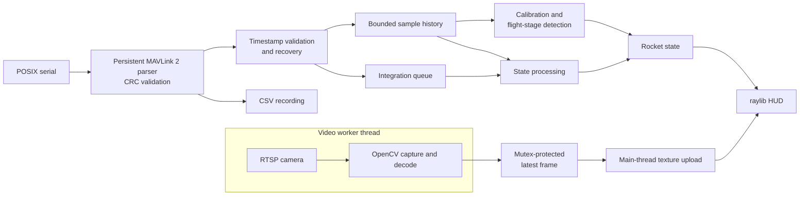

<div align="center">

# BYU Telemetry HUD

### Real-time telemetry, flight-state processing, and visualization for BYU High Power Rocketry

**C++20 · MAVLink 2 · raylib · OpenCV · RTSP · CMake**

<br>


<br>

*A ground-station application for receiving, processing, recording, and visualizing live high-power rocket telemetry.*

</div>

---

## Overview

The **BYU Telemetry HUD** is a C++20 ground-station application built for BYU's High Power Team. Developed in roughly two months, this system includes a custom MAVLink parser, serial I/O, buffering and resynchronization, sensor calibration, motion estimation, automatic flight-stage detection, multithreaded RTSP video, data logging, and a real-time ground-station HUD built with raylib.

## Deployment

This is software **built for flight.** Much of its development focused on handling the realities of live telemetry: timestamp discontinuities, noisy sensor data, interrupted streams, and signal loss. IREC 2026 provided the first opportunity to test those decisions in a real flight environment—and exposed several failure modes we had not encountered on the ground.

### IREC 2026


The telemetry system was deployed at the 2026 International Rocket Engineering Competition aboard BYU High Power Rocketry's competition vehicle. It was responsible for receiving live sensor telemetry and video, recording incoming data, estimating vehicle state, and providing operators with a real-time ground-station display.

Shortly after launch, the 5 GHz telemetry link was lost, leaving the ground station with only sparse data for the remainder of the flight. An SD-card reader issue discovered just hours before launch also prevented the custom flight computer from logging telemetry onboard. After recovering the rocket, we discovered that both redundant commercial flight computers had also failed to produce usable flight records. Without another source of data, we risked having no recorded apogee to submit to the competition judges.

The ground station, however, had logged every telemetry packet it successfully received. From that sparse recording, we recovered a peak recorded altitude of approximately **27,000 ft**, providing the team's only usable apogee data and contributing to a **4th-place finish in our competition category.**

### Lessons from Flight

**Ground-station logging proved its value as an independent data path.** Although the RF link performed poorly, every packet that reached the application was recorded. When the onboard logging systems failed, those ground-station records became the team's only usable source of apogee data.

Some of the biggest failures were no onboard logging and no onboard state estimation. Because the state estimation logic was being performed **on the ground,** after any loss of connection, we could not reliably determine the state of the vehicle. This was an oversight that we are going to fix in the upcoming year.

Another downfall to the current system is **lack of testability.** There are a couple builds that _allow_ testing, but they are for inspecting visuals and running it against a CSV file of data from our test flight. These are good, but they have their limits with utility. Testing the robustness of the error handling system, for example, was difficult to do in a meaningful way. Testing the accuracy of the state estimation (past what you can do by just inspecting its behavior when simulating the test flight data) was also difficult to do, and we were unsure as to how well it would work during our _actual_ flight.

### What We're Changing

This upcoming year, we want to win the Live Telemetry / Live Video award at IREC. This will obviously require addressing the problems previously described, i.e. on-vehicle logging and state estimation, higher testability, more diagnosable errors, etc., but it will also require making fundamental improvements to how data is shown to the user. We need to add features, make the visuals nicer, and test it frequently.

Some of the proposed changes so far are:

* GPS position + map
* Kalman filtering for improved state estimation
* Status indicators for all measurements
* Putting the 3D attitude visualization into a real world model using Unreal Engine


---

[Capabilities](#current-capabilities) · [Architecture](#system-architecture) · [Engineering Decisions](#engineering-decisions) · [Testing & Limitations](#testing--limitations) · [Build & Run](#build--run)

## Current Capabilities

The implementation described below is the current ground-station system. The changes proposed above are future work; onboard estimation, Kalman filtering, GPS mapping, and the Unreal Engine visualization are not presented as completed capabilities.

| Area | Implemented behavior |
| :--- | :--- |
| **Telemetry ingestion** | Nonblocking POSIX serial input; persistent MAVLink 2 parsing with CRC validation and timestamp recovery |
| **State processing** | Startup sensor calibration, quaternion-based attitude integration, acceleration processing, and automatic flight-stage detection |
| **Operator display** | 3D rocket attitude, flight stage, altitude history, instrumentation, and RTSP camera feed in a raylib HUD |
| **Live video** | OpenCV capture on a worker thread, latest-frame handoff, and reconnect handling |
| **Recording** | Decoded telemetry written to CSV before timestamp filtering |

Flight deployment demonstrated the value of ground logging. The sparse telemetry recovered at IREC does not establish the accuracy of every estimator or stage-detection rule.

## System Architecture

Telemetry processing and rendering share the main application thread. Camera capture and decoding run separately so that waiting for a video frame does not directly block the telemetry loop.



The main loop drains available serial bytes, decodes and records samples, validates their timestamps, updates history, runs flight-stage detection, processes queued samples, and draws the resulting state. Video frames cross the thread boundary through a shared frame buffer; raylib texture updates and drawing stay on the main thread.

## Engineering Decisions

### Preserve received data before interpreting it

The CSV logger branches off immediately after decoding, before timestamp filtering. A sample that is unsuitable for state integration can still be available for post-flight inspection. This keeps the recording path independent of downstream timestamp acceptance, while still requiring a valid decoded telemetry frame.

### Recover timing before resuming integration

Serial reads do not necessarily align with MAVLink frame boundaries, so the parser retains partial frames between reads. It validates CRCs, rejects oversized payloads, and ignores unrelated message IDs.

At the sample level, accepted timestamps must advance. When source time moves backward, the application waits for **five strictly increasing timestamps** before reseeding its history and processing queue. This avoids treating a clock discontinuity as ordinary integration time. It cannot reconstruct telemetry lost over the RF link.

### Bound recent history

Calibration, stage detection, altitude-slope estimates, and rolling angular-rate readouts share a `SampleRingBuffer` capped at **200 samples and three seconds**. This bounds the retained history used for those calculations; the effective time window also depends on the incoming sample rate.

### Favor fresh video over a growing queue

The video worker retains only the **latest decoded frame**. If a newer frame arrives before the HUD consumes the previous one, it can replace the older frame. This trades preservation of every video frame for recent operator imagery and prevents an accumulating queue between capture and display.

### Keep estimation claims explicit

Attitude uses bias-corrected gyroscope integration, with quaternion normalization after each processed sample. It currently has **no accelerometer or magnetometer correction**, so drift remains a limitation. The HUD's vertical-velocity readout uses a rolling altitude slope, even though the state processor also computes acceleration-integrated velocity.

## Operator Display

The HUD combines the rocket model and camera feed with instrumentation and flight history.

| Readout | Source |
| :--- | :--- |
| **AGL / ASL altitude** | Received altitude minus calibrated ground altitude / received `altM` |
| **Vertical velocity** | Rolling two-second altitude slope |
| **G-force** | Magnitude from the selected normal-range or high-G accelerometer |
| **Roll, pitch, and yaw rates** | Rolling gyroscope measurements |
| **Flight stage** | Automatic detector using sensor history and elapsed time |
| **Altitude history** | AGL altitude plotted against time since launch |
| **3D attitude** | Gyroscope-integrated quaternion orientation |
| **Camera** | RTSP frames decoded by OpenCV |

## Testing & Limitations

The repository provides manual inspection and diagnostic tools, but it does not yet provide a complete automated verification path. Visual inspection and deployment experience are useful evidence; they do not substitute for repeatable tests of estimator accuracy or failure handling.

| Target / infrastructure | Purpose and current status |
| :--- | :--- |
| `static_test` | Renders the HUD without telemetry hardware for visual inspection |
| `sensor_out` | Reads serial MAVLink telemetry and prints decoded sample timestamps |
| `raven_test` | Working recorded-telemetry test, hard-coded to read CSV data from the FAR test flight |
| `replay` | Intended to recreate a flight using synchronized video and CSV telemetry, configured through `include/telemetry/feed/sync.json`. Currently incomplete: CSV text cannot feed the active binary MAVLink parser, leaving the HUD in calibration. Configured file paths are also empty. |
| GoogleTest project in `tests/` | Build configuration is incomplete and is not registered with CTest |

The repository includes sensor CSV recordings, raw MAVLink captures, commercial flight-computer exports, GPS CSV/KML data, OpenRocket simulation data, conversion scripts, and video/telemetry synchronization configuration. These support investigation and future test fixtures; their presence does not imply a working regression suite.

**Current operating limits:**

- Gyro-only attitude and acceleration-integrated velocity lack external drift correction.
- Flight-stage thresholds are heuristic; their validation basis is not documented in the source README.
- Packet-drop statistics are not exposed in the HUD.
- Operational settings are largely configured at compile time.
- Serial I/O is POSIX-based, with a macOS-specific configured device path and no Windows serial backend.
- Lost RF packets remain unavailable to the ground station; onboard logging and estimation are part of the proposed response described above.

## Build & Run

**Requirements:** CMake 3.20+, a C++20 compiler and standard library supporting `std::format` and chrono formatting, raylib, and OpenCV.

Before building for live hardware, set the serial device, baud rate, and RTSP URL in `include/telemetry/telemetry_config.hpp`.

From the repository root:

```bash
cmake -S . -B build
cmake --build build --target BYU_Telemetry_HUD --parallel
mkdir -p data/logged_data
./build/BYU_Telemetry_HUD
```

Run from the repository root because model, shader, and font paths are relative to the working directory.

To inspect the HUD without flight hardware, use the static display target after configuring the build:

```bash
cmake --build build --target static_test --parallel
./build/static_test
```

The static target previews the interface; it does not simulate a flight or validate telemetry processing.

## Technical Reference

<details>
<summary><strong>Telemetry format and recording schema</strong></summary>

The active parser accepts a project-specific MAVLink 2 message:

| Property | Value |
| :--- | :--- |
| Message ID | `300` |
| CRC extra | `95` |
| Payload | 72 bytes: one little-endian `uint64_t` timestamp and 16 little-endian 32-bit floats |
| Signed frames | Signature trailer length is accounted for; authentication is not performed |

The decoded `SensorData` fields map to the CSV recording schema:

```csv
t_us,ax,ay,az,gx,gy,gz,mx,my,mz,imuTempC,baroTempC,pressPa,altM,hgx,hgy,hgz
```

These contain the timestamp, normal accelerometer, gyroscope, magnetometer, IMU temperature, barometer temperature and pressure, altitude, and high-G accelerometer measurements.

</details>

<details>
<summary><strong>Calibration, coordinate frames, and motion processing</strong></summary>

Startup calibration uses a stationary telemetry window to average both accelerometers and the gyroscope. Measurements are converted from sensor coordinates to the rocket body frame:

```text
sensor (x, y, z) → body (z, -y, x)
```

The expected gravity contribution is removed from the body-Z accelerometer means. The gyroscope mean becomes the gyro bias, and mean received altitude becomes the ground-altitude reference. Calibration then advances the state to Pad.

For attitude updates, gyroscope measurements are mapped into body coordinates and bias-corrected. Angular rate multiplied by the sample interval produces an axis-angle quaternion increment, which is converted to rendering coordinates, multiplied into the current orientation, and normalized.

The acceleration processor selects the high-G measurement when its vector magnitude reaches the current **100 m/s²** switching threshold. It applies the matching bias, transforms the measurement, removes gravity according to the application's frame convention, and integrates acceleration over time. This integrated velocity is separate from the altitude-slope velocity shown in the HUD.

</details>

<details>
<summary><strong>Flight-stage detection rules</strong></summary>

**Calibrating → Pad → Boost → Coast → Apogee → Descent → Recovery**

| Transition | Current logic |
| :--- | :--- |
| Calibrating → Pad | Calibration history reaches the requested duration |
| Pad → Boost | 0.5 s mean normal-acceleration magnitude > `50 m/s²` |
| Boost → Coast | 0.3 s mean acceleration < `15 m/s²`, after > 1 s in Boost |
| Coast → Apogee | > 10 s in Coast and 0.5 s altitude slope < `10 m/s` |
| Apogee → Descent | > 5 s in Apogee |
| Descent → Recovery | > 240 s in Descent, low altitude slope, and low angular rate |

The state layer rejects backward transitions and attempts to skip stages. These are the current detection rules, not a claim of validated performance across flight profiles.

</details>

<details>
<summary><strong>Video recovery behavior</strong></summary>

For RTSP sources, the OpenCV worker requests TCP transport, uses a three-second open timeout and a one-second read timeout, and retries unopened streams after 500 ms. It releases and reopens the decoder after sustained failed reads or more than two seconds without a good frame.

The latest frame is handed off under a mutex. BGR-to-RGB conversion and texture upload occur on the main thread before the HUD draws the camera panel.

</details>

<details>
<summary><strong>Repository guide</strong></summary>

```text
.
├── CMakeLists.txt
├── include/
│   ├── hud/                 # HUD state, layout, resources, display configuration
│   ├── telemetry/           # Sources, parsing, samples, buffering, serial config
│   │   └── feed/            # Camera buffering and replay configuration
│   ├── state/               # Rocket state, calibration, coordinate transforms
│   │   └── detection/       # Flight-stage detection interface
│   ├── logging/             # Sensor and diagnostic logging
│   └── util/
├── src/
│   ├── hud/                 # Application loop and rendering
│   ├── telemetry/           # Serial, MAVLink/CSV parsing, video workers
│   ├── state/               # State processing and flight-stage detection
│   └── logging/
├── tests/                   # Manual tools and incomplete GoogleTest project
├── resources/               # GLB models, GLSL shaders, HUD font
└── data/                    # Telemetry captures and flight-analysis data
```

</details>

---

Developed for **BYU High Power Rocketry**.
