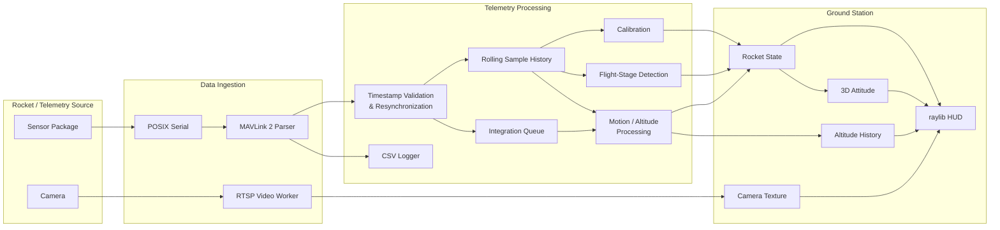
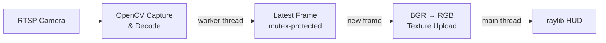

<div align="center">

# BYU Telemetry HUD

### Real-time telemetry, flight-state processing, and visualization for BYU High Power Rocketry

**C++20 · MAVLink 2 · raylib · OpenCV · RTSP · CMake**

<br>

<!-- TODO: Replace with your best current screenshot or, preferably, a short GIF of live telemetry. -->


<br>

*A ground-station application for receiving, processing, recording, and visualizing live high-power rocket telemetry.*

</div>

---

## Overview

The **BYU Telemetry HUD** is a C++20 ground-station application built for BYU's High Power Team. It turns a live MAVLink telemetry stream into an operator-facing view of the rocket's state, combining sensor readouts, automatic flight-stage detection, a 3D attitude visualization, altitude history, and an RTSP camera feed in one interface.

The application is built around a custom MAVLink 2 sensor message carrying a timestamp and **16 floating-point sensor values**. Incoming data is decoded, validated, buffered, calibrated, processed into motion and altitude estimates, and rendered in real time. A separate video worker receives camera frames without putting capture and decoding work on the main rendering thread.

> [!IMPORTANT]
> **TODO — Add deployment context:** Briefly describe where/when this system was flown or field-tested, what role it played, and the most meaningful verified result.  
> Suggested material to verify and add: IREC 2026, flight altitude, telemetry rate, and what data the system successfully recovered.

### At a glance

| | |
| :--- | :--- |
| **Language** | C++20 |
| **Purpose** | High-power rocket telemetry ground station |
| **Telemetry protocol** | MAVLink 2, custom message ID `300` |
| **Telemetry payload** | `uint64_t` timestamp + 16 `float` values (72 bytes) |
| **Visualization** | raylib, 3D GLB rocket model, live instrumentation |
| **Video** | OpenCV + RTSP, worker-thread capture |
| **Input** | POSIX serial |
| **Logging** | Decoded telemetry to CSV |
| **Current platform** | macOS / POSIX serial implementation |

---

## What It Does

<table>
<tr>
<td width="50%" valign="top">

### Live Telemetry

Consumes a nonblocking serial byte stream and incrementally reconstructs custom **MAVLink 2** frames.

- Persistent parser handles frames split across reads
- CRC validation before samples enter the state pipeline
- Rejects oversized payloads and ignores unrelated message IDs
- Tracks successful frames and parser failures internally
- Handles telemetry timestamp discontinuities and resynchronization

</td>
<td width="50%" valign="top">

### 3D Attitude Visualization

Uses IMU angular-rate measurements to update a live 3D representation of the rocket.

- Quaternion-based orientation integration
- Gyroscope bias compensation
- Sensor-to-body coordinate transformation
- Body-to-render coordinate conversion
- Normalized orientation updates every processed sample

</td>
</tr>

<tr>
<td width="50%" valign="top">

### Automatic Flight Staging

Tracks the rocket through the flight sequence without requiring the operator to manually change modes.

```text
CALIBRATING
     ↓
    PAD
     ↓
   BOOST
     ↓
   COAST
     ↓
  APOGEE
     ↓
  DESCENT
     ↓
 RECOVERY
```

Transitions use rolling acceleration, altitude-rate, angular-rate, and timing conditions.

</td>
<td width="50%" valign="top">

### Live Video

Displays an RTSP camera stream alongside telemetry.

- Capture and decoding run on a worker thread
- Thread-safe latest-frame handoff
- Main-thread texture upload for raylib
- Stream open/read timeouts
- Automatic release and reconnect after sustained failures
- Latest-frame design prevents an accumulating video queue

</td>
</tr>
</table>

<!-- TODO: Add a 2-column screenshot/GIF section here.
     Left: attitude visualization moving with recorded/live telemetry.
     Right: camera + instrumentation during a test.
-->

---

## Operator Display

The HUD is designed to put the rocket's most useful live information in one place. The current interface combines a **3D rocket scene and camera feed** with flight-stage indicators, instrumentation, and altitude history.

Current readouts include:

| Display | Source / behavior |
| :--- | :--- |
| **AGL altitude** | Received altitude minus calibrated ground altitude |
| **ASL altitude** | Received `altM` telemetry value |
| **Vertical velocity** | Rolling two-second altitude slope |
| **G-force** | Magnitude from the selected normal/high-G accelerometer |
| **Roll / pitch / yaw rates** | Rolling gyroscope measurements |
| **Flight stage** | Automatic stage detector |
| **Altitude history** | AGL altitude plotted against time since launch |
| **3D attitude** | Gyroscope-integrated quaternion orientation |
| **Camera** | RTSP stream decoded through OpenCV |

<!-- TODO: Add an annotated HUD screenshot here.
     Consider numbering 4–6 important areas and explaining them in a compact legend.
-->

---

## System Architecture



The main application loop drains available telemetry, feeds bytes through a persistent MAVLink parser, records decoded samples, validates timestamps, updates rolling history, runs flight-stage detection, processes queued samples, and renders the resulting state. Camera capture and decoding are isolated on a worker thread; telemetry parsing, state processing, texture updates, and drawing currently run on the main thread.

> [!NOTE]
> **TODO — Design rationale:** Add 2–4 sentences explaining the constraints that led to this architecture and the telemetry-rate/responsiveness requirements it was designed around.

---

## Telemetry Pipeline

```text
Serial Device
     │
     ▼
Raw MAVLink Byte Stream
     │
     ▼
┌─────────────────────────┐
│ Streaming Frame Parser  │
│ • frame synchronization │
│ • partial-frame buffer  │
│ • CRC validation        │
└────────────┬────────────┘
             │
             ▼
       Sensor Sample
             │
       ┌─────┴───────────────┐
       │                     │
       ▼                     ▼
   CSV Logger        Timestamp Validation
                             │
                             ▼
                   Rolling Sample History
                      │             │
                      ▼             ▼
                 Calibration    Stage Detection
                      │             │
                      └──────┬──────┘
                             │
                    Integration Queue
                             │
                             ▼
                    State Processing
                             │
                             ▼
                       RocketState
                             │
                             ▼
                           HUD
```

### Custom MAVLink message

The active parser accepts a project-specific MAVLink 2 message:

| Property | Value |
| :--- | :--- |
| **Message ID** | `300` |
| **CRC extra** | `95` |
| **Payload size** | 72 bytes |
| **Timestamp** | 1 × little-endian `uint64_t` |
| **Sensor values** | 16 × little-endian 32-bit floats |
| **Signed MAVLink frames** | Signature trailer length accounted for; authentication is not performed |

The payload maps directly into the application's `SensorData` representation:

```text
t_us
│
├── Normal accelerometer ── ax, ay, az
├── Gyroscope ───────────── gx, gy, gz
├── Magnetometer ────────── mx, my, mz
├── IMU temperature ─────── imuTempC
├── Barometer ───────────── baroTempC, pressPa
├── Altitude ────────────── altM
└── High-G accelerometer ── hgx, hgy, hgz
```

> [!NOTE]
> **TODO — Protocol context:** Add the location of the transmitting firmware / authoritative MAVLink definition and a short explanation of why a custom message was selected.

---

## Robust Telemetry Ingestion

A flight telemetry link cannot assume perfectly ordered, uninterrupted input. The ingestion path includes several mechanisms for maintaining a usable stream when incoming data is fragmented or timing changes unexpectedly.

### Frame-level handling

The MAVLink parser:

- Maintains incomplete data across serial reads
- Scans for the MAVLink 2 `0xFD` start byte
- Validates CRCs
- Rejects oversized payloads
- Ignores unrelated message IDs
- Accounts for the optional MAVLink signature trailer length

### Timestamp recovery

Accepted samples are required to advance in time. If the source timestamp moves backward, the application enters a resynchronization path and waits for **five strictly increasing timestamps** before reseeding its sample history and processing queue.

This prevents an immediate clock discontinuity from being integrated as if it were ordinary flight data.

### Rolling history

A bounded `SampleRingBuffer` retains recent telemetry for operations that need a time window rather than a single sample, including:

- Startup calibration
- Flight-stage detection
- Vertical-velocity estimation
- Rolling angular-rate readouts

The current implementation caps this history at **200 samples** and at most **three seconds**.

> [!NOTE]
> **TODO — Engineering rationale:** Explain the expected telemetry rate and why the 200-sample capacity, three-second history, 40 ms calibration tolerance, and five-sample resynchronization rule were selected.

---

## Calibration & State Processing

Before entering the Pad state, the application collects a stationary telemetry window and estimates sensor offsets.

### Startup calibration

The calibration process:

1. Averages the normal accelerometer, high-G accelerometer, and gyroscope over the retained history.
2. Converts those measurements from the sensor frame into the rocket body frame.
3. Removes the expected gravity contribution from the body-Z accelerometer means.
4. Stores the gyroscope mean as its bias.
5. Stores mean received altitude as ground altitude.
6. Advances the state machine from **Calibrating → Pad**.

The fixed sensor-to-body mapping is:

```text
sensor (x, y, z)  →  body (z, -y, x)
```

### Attitude

Orientation is represented as a quaternion. For each processed sample, the application:

1. Maps gyroscope data into body coordinates.
2. Subtracts the calibrated gyro bias.
3. Converts angular rate × `dt` into an axis-angle quaternion increment.
4. Converts that increment into rendering coordinates.
5. Multiplies it into the current orientation.
6. Normalizes the resulting quaternion.

The current estimator is intentionally simple: **attitude is gyro-integrated and does not currently use accelerometer or magnetometer correction.**

### Acceleration and velocity

The state processor supports both normal-range and high-range accelerometers. It selects the high-G measurement when the high-range acceleration-vector magnitude reaches the current `100 m/s²` switching threshold, applies the corresponding bias, transforms the measurement, removes gravity according to the application's frame convention, and integrates acceleration over time.

> [!IMPORTANT]
> **Current limitation:** Integrated velocity is calculated, but the current HUD's displayed vertical velocity comes from the rolling altitude slope. The active attitude path is gyro-only and therefore does not provide long-term drift correction.

<!-- TODO: If state estimation / Kalman filtering has since changed in the repository,
     update this section rather than describing planned work as implemented.
-->

---

## Automatic Flight-State Detection

Flight stages are determined from recent sensor history and telemetry timestamps.

<div align="center">

**Calibrating → Pad → Boost → Coast → Apogee → Descent → Recovery**

</div>

| Transition | Current detection logic |
| :--- | :--- |
| **Calibrating → Pad** | Calibration history reaches the requested duration |
| **Pad → Boost** | 0.5 s mean normal-acceleration magnitude > `50 m/s²` |
| **Boost → Coast** | 0.3 s mean acceleration < `15 m/s²` after > 1 s in Boost |
| **Coast → Apogee** | > 10 s in Coast and 0.5 s altitude slope < `10 m/s` |
| **Apogee → Descent** | > 5 s in Apogee |
| **Descent → Recovery** | > 240 s in Descent, low altitude slope, and low angular rate |

State transitions are monotonic: the state layer rejects backward transitions and attempts to skip over a flight stage.

> [!NOTE]
> **TODO — Validation:** Add the flight data, simulations, or requirements used to choose and validate these thresholds. If these are preliminary heuristics, say so explicitly.

---

## Video Pipeline

The camera path is deliberately separated from telemetry processing.



Rather than building a queue of camera frames, the `FrameBuffer` stores only the **latest available frame**. If capture produces frames faster than the HUD consumes them, an older frame can be replaced. This favors displaying recent imagery over preserving every video frame.

For RTSP sources, the worker currently:

- Requests TCP transport
- Uses a 3 s open timeout
- Uses a 1 s read timeout
- Retries unopened streams after 500 ms
- Releases and reopens the decoder after sustained failed reads or more than 2 s without a good frame

<!-- TODO: Add a short GIF of the live camera panel if you have footage that is
     appropriate to publish.
-->

---

## Data Logging & Recorded Flight Data

The live target can record each decoded telemetry sample to CSV before timestamp filtering, preserving the sensor stream for later inspection.

```csv
t_us,ax,ay,az,gx,gy,gz,mx,my,mz,imuTempC,baroTempC,pressPa,altM,hgx,hgy,hgz
```

The repository also contains tooling and data for working with recorded flights, including:

- Sensor CSV recordings
- Raw MAVLink binary captures
- Primary and secondary flight-computer exports
- GPS CSV/KML data
- OpenRocket simulation data
- Conversion scripts for producing test fixtures
- Video/telemetry synchronization configuration

### Replay status

> [!WARNING]
> **Replay is currently incomplete.** The existing timed CSV source emits CSV text while the active state-ingestion path expects MAVLink bytes. As a result, the current `replay` and `raven_test` paths do not yet drive the HUD through the active parser.

This limitation is kept explicit here so the README distinguishes implemented capabilities from work in progress.

---

## Real-World Deployment

<!--
TODO: THIS SHOULD BECOME ONE OF THE MOST IMPORTANT SECTIONS OF THE README.

Recommended structure:

### IREC 2026

[PHOTO OF ROCKET / TEAM / LAUNCH]

2–3 paragraphs:
- What the system was built to do.
- How long you had to build it / what you personally owned, if appropriate.
- What hardware it communicated with.
- What happened during the actual flight.
- What worked and what failed.
- What telemetry was recovered and how it mattered.

Then add a compact metrics row, for example ONLY AFTER VERIFYING THE NUMBERS:

| Flight | Telemetry | Payload | Video |
| --- | --- | --- | --- |
| ~30,000 ft | 60 Hz | 17 fields | 1080p / 60 fps |

Do not add those values solely because they are suggested here; verify them against
the deployed configuration / flight records first.
-->

<div align="center">

### [TODO: Add competition / flight deployment story]

*This section is intentionally reserved for verified field-performance context.*

</div>

---

## Testing & Verification

The repository includes several diagnostic and test-oriented executables:

| Target | Purpose |
| :--- | :--- |
| `static_test` | Renders the HUD without a telemetry source for visual inspection |
| `sensor_out` | Reads serial MAVLink telemetry and prints decoded sample timestamps |
| `raven_test` | Timed recorded-data test path; currently affected by the CSV/MAVLink mismatch |
| `replay` | Recorded telemetry + video playback path; currently incomplete |

A separate GoogleTest project also exists under `tests/`, but its build configuration is currently incomplete and is not registered with CTest.

> [!NOTE]
> **TODO — Verification story:** Add the strongest tests you actually use: recorded-flight regression tests, reference measurements, hardware-in-the-loop tests, parser fixtures, stage-transition tests, or other acceptance criteria. This section will become much stronger once the automated test path is repaired.

---

## Current Development

<!-- TODO: Replace this placeholder with CURRENT, VERIFIED work.
     Keep planned features separate from completed features.

Suggested categories if they are genuinely in progress:
- State estimation / sensor fusion
- GPS + map visualization
- Link-health / packet-loss instrumentation
- Recorded-flight replay
- HIL/SIL integration
- 6-DOF simulation integration
- Configurable operator views
- Automated regression testing
-->

The current repository represents an evolving telemetry platform rather than a finished product.

### [TODO: Add current development priorities]

- [ ] [Current priority]
- [ ] [Current priority]
- [ ] [Current priority]
- [ ] [Current priority]

---

## Repository Structure

```text
.
├── CMakeLists.txt
├── include/
│   ├── hud/                  # HUD state, layout, resources, and display config
│   ├── telemetry/            # Sources, parsers, samples, buffering, serial config
│   │   └── feed/             # Camera/frame buffering and replay configuration
│   ├── state/                # Rocket state, calibration, coordinate transforms
│   │   └── detection/        # Flight-stage detection interface
│   ├── logging/              # Sensor and diagnostic logging
│   └── util/
│
├── src/
│   ├── hud/                  # Application loop and rendering
│   ├── telemetry/            # Serial, MAVLink/CSV parsing, video workers
│   ├── state/                # State processing and flight-stage detection
│   └── logging/
│
├── tests/                    # Manual tools and GoogleTest project
├── resources/                # GLB models, GLSL shaders, and HUD font
└── data/                     # Telemetry captures and flight-analysis data
```

---

## Build & Run

### Requirements

- **CMake 3.20+**
- **C++20** compiler / standard library with `std::format` and chrono-formatting support
- **raylib**
- **OpenCV**

The current serial implementation uses POSIX `open`, `read`, and `termios`. The configured serial-device path is macOS-specific; there is currently no Windows serial backend.

### Build the live application

```bash
cmake -S . -B build
cmake --build build --target BYU_Telemetry_HUD --parallel
```

Run the executable **from the repository root**, because the current model, shader, and font paths are relative to the process working directory.

```bash
mkdir -p data/logged_data
./build/BYU_Telemetry_HUD
```

### Preview without flight hardware

The static HUD target can be used to inspect the interface without connecting a telemetry device:

```bash
cmake --build build --target static_test --parallel
./build/static_test
```

### Hardware configuration

Before running against live hardware, configure:

```text
include/telemetry/telemetry_config.hpp
```

The current configuration contains the serial device, baud rate, and RTSP URL.

> [!TIP]
> For a recruiter-facing repository, keep this section intentionally short. Detailed dependency, replay, and troubleshooting instructions are better placed in `docs/` as the project matures.

---

## Known Limitations

This project is actively evolving. Important limitations in the current checkout include:

- Recorded CSV replay does not yet feed the active MAVLink-only state path.
- Attitude estimation currently integrates gyroscope data without accelerometer or magnetometer correction.
- Integrated velocity has no external correction.
- Packet-drop statistics are not currently surfaced in the HUD.
- Operational settings are largely compile-time configuration.
- The serial backend is POSIX/macOS-oriented.
- The automated GoogleTest build requires repair before it provides a complete test suite.

Keeping these limitations explicit makes it easier to distinguish the current implementation from planned improvements.

---

## Tech Stack

<div align="center">

| Core | Visualization | I/O & Media | Build / Test |
| :---: | :---: | :---: | :---: |
| C++20 | raylib | MAVLink 2 | CMake |
| Quaternions | GLSL | POSIX Serial | GoogleTest* |
| Sensor processing | GLB models | OpenCV / RTSP | Recorded telemetry |

<sub>*GoogleTest infrastructure exists but the current standalone test build is incomplete.</sub>

</div>

---

## Acknowledgments

Developed for **BYU High Power Rocketry**.

<!-- TODO:
- Add collaborators / subteam members if appropriate.
- Add competition attribution.
- Add credits for any externally sourced model, font, shader, or other asset
  where the license requires attribution.
-->

---

<div align="center">

**[TODO: Add a final launch/HUD GIF or team/rocket image]**

*Built to turn raw flight data into information an operator can use in real time.*

</div>
